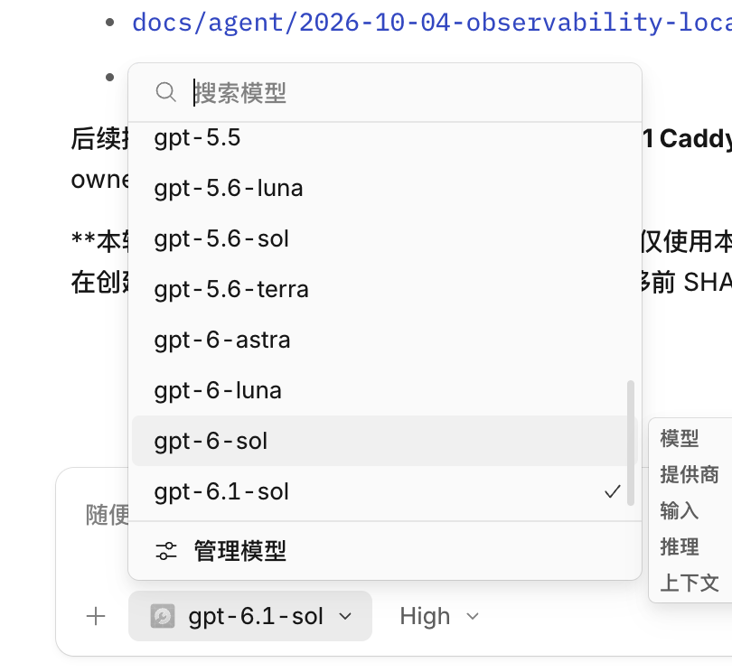

# AI Aggregator Gateway

一个入口，聚合订阅模型、官方 API 与开源模型。面向个人工作站和团队，让 OpenCode、IDE 与自动化 Agent 共用模型与用户权限。

## 架构

```text
客户端 → Caddy TLS → [可选 APISIX / Kong] → New API
                                             ├→ CPA：订阅账号矩阵
                                             └→ LiteLLM：官方 API / NVIDIA / Ollama
```

New API 管理用户、套餐、额度和消费记录；CPA 隔离账号 OAuth；LiteLLM 适配上游、重试与统计成本。
Home-Lab 是参考环境，当前采用 Caddy → New API 直连模式。

## 聚合能力

| 来源 | 接入能力 |
|---|---|
| CPA | GPT / Codex、Claude、Google 订阅账号 |
| LiteLLM | 官方 API、NVIDIA NIM、Ollama Cloud；AMD / 本地 Ollama 可选 |
| 公共网关 | Caddy TLS；APISIX / Kong 可选认证、ACL、限流与审计 |

模型与协议按账号逐项验证；目录可见不等于可推理，开发者额度不等于永久免费。
详细清单见 [接入能力与模型](docs/models/capabilities.zh.md)。

## 已验证模型

2026-10-07 的参考环境已记录 **36 个模型最小聊天请求成功**，涵盖商业订阅与开源模型。

| 来源 | 模型 ID |
|---|---|
| GPT / Codex | `gpt-5.5`、`gpt-5.6-luna`、`gpt-5.6-sol`、`gpt-5.6-terra`、`gpt-6-astra`、`gpt-6-luna`、`gpt-6-sol`、`gpt-6.1-sol`、`gpt-oss-120b-medium`、`codex-auto-review` |
| Claude | `claude-opus-4-5-20251101`、`claude-opus-4-6`、`claude-opus-4-7`、`claude-opus-4-8`、`claude-opus-5`、`claude-sonnet-4-5-20250929`、`claude-sonnet-5`、`claude-sonnet-5-5` |
| Google | `gemini-3-flash`、`gemini-3.1-flash-lite`、`gemini-3.1-pro-low`、`gemini-3.5-flash-lite`、`gemini-3.6-flash-high`、`gemini-3.7-flash-high`、`gemini-3.8-flash-high`、`gemini-pro-agent` |
| NVIDIA NIM | `openai/gpt-oss-20b`、`nvidia/nemotron-3.5-lightning-30b-a3b`、`deepseek-ai/deepseek-v4.1-flash`、`z-ai/glm-5.3`、`z-ai/glm-5.3-flash` |
| Ollama Cloud | `gpt-oss:120b`、`gpt-oss:20b`、`gemma4:31b`、`nemotron-3-super`、`nemotron-3-ultra` |

实时目录曾返回 52 项；上表只列已有推理成功记录的模型。SSE、工具调用及其他协议需分别验收。

## OpenCode App 接入

同一个 Provider 中选择模型，账号 OAuth 和上游 Key 由网关侧管理。



截图展示部分 GPT 模型；当前目录已同步 52 项，完整清单与验证状态见上方模型表及子文档。
客户端配置统一的 `/v1` 端点，通过 `opencode auth login ai-internal` 保存自己的 New API 用户 Key。
详见 [客户端接入与验证](docs/home-lab/client-acceptance-tldr.zh.md)。

## 快速开始

先查看帮助，确认目标与前置条件：

```bash
curl -fsSL "https://raw.githubusercontent.com/ai-workspace-services/ai-aggregato-Gateway/main/scripts/home-lab/one-shell.sh" \
  | bash -s -- --help
```

脚本不是空机安装器：需已有服务、数据库、SSH/sudo 与 Vault 运行时注入。
无参数默认操作参考 Home-Lab 并执行 `activate`；其他环境先显式指定目标并运行 `plan`。
生产部署应固定已审核的 tag / commit，而不是可变的 `main`。

## 文档导航

| 文档 | 内容 |
|---|---|
| [模块设计](docs/llm-modules-hub.zh.md) | 职责边界、模块生命周期与配置契约 |
| [能力与模型](docs/models/capabilities.zh.md) | 模型清单、验证状态与失败项 |
| [部署指南](docs/deployment/quick-start.zh.md) | 引导脚本、CLI、网络模式与高级参数 |
| [OAuth 登录](docs/home-lab/cpa-oauth-tldr.zh.md) | CPA 账号隔离与人工登录 |
| [Vault 契约](docs/home-lab/vault-contract.md) | 密钥归属与运行时注入 |
| [客户端验收](docs/home-lab/client-acceptance-tldr.zh.md) | 统一入口接入与请求验证 |
| [Ollama 验证](docs/home-lab/ollama-cloud-validation-20261007.md) | 上游与 HTTPS 实测结果 |

客户端使用 New API 用户 Key；Provider Key 与 OAuth 不进入 Git 或客户端配置。
本项目不替代 Cloudflare `edge-gateway` 的 Web SaaS `/api/*` 链路。
